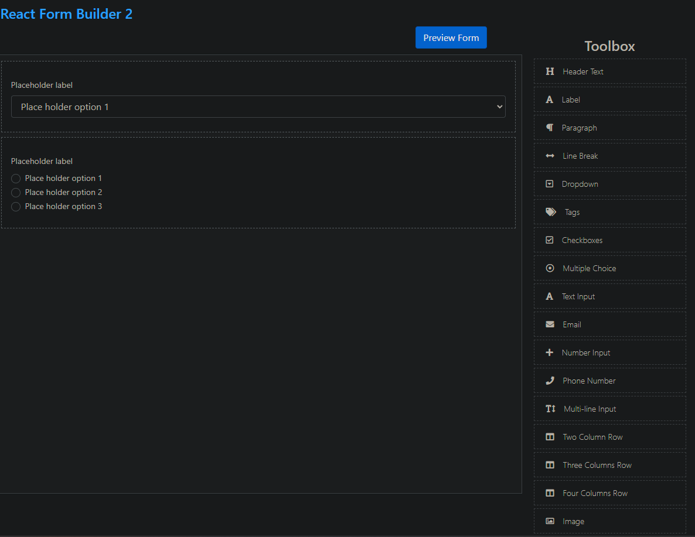
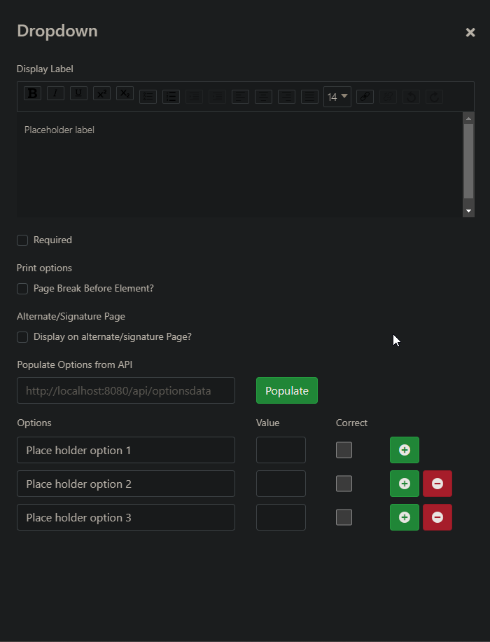
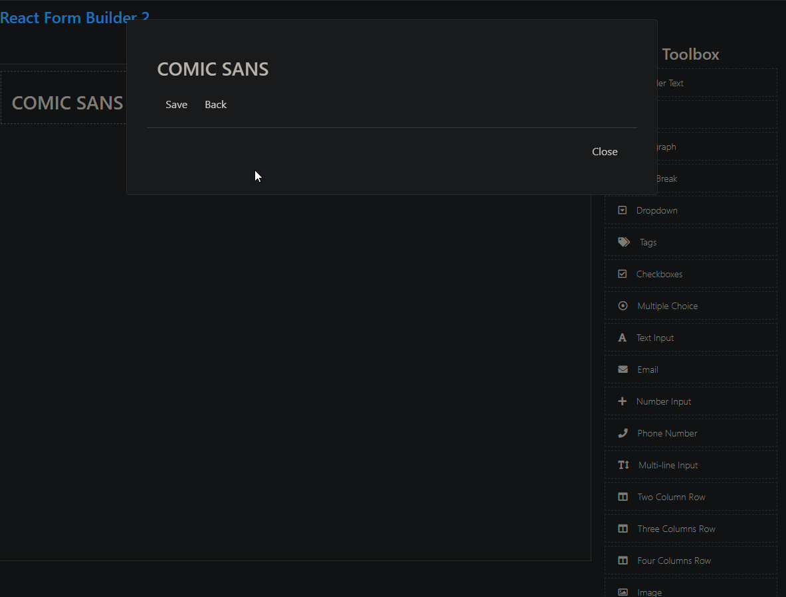

In my last frontend entry , I have mapped out a few custom components I needed to build. I realized after the fact that `react-form-builder2` met all of those needs perfectly.

I should have spent a bit more time on the ole R&D. I mean this only in regards to the formbuilder.

I will attach photos from the [formbuilders live-demo](https://kiho.github.io/react-form-builder/)

[react-form-builder](https://github.com/trax-retail/react-form-builder) 1 for reference (formData,formDef)

After this implementation I will likely begin work on the Activity Editor or the Package Editor. These will also be pages available on the portal. These will undoubtly be Monaco editors or variants of them due to the validation checks required and because Monaco is great.
